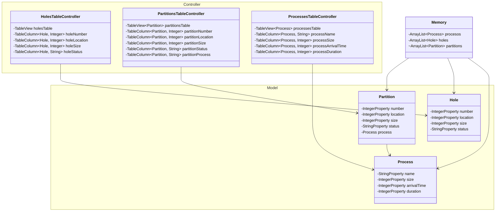

## Setup

Usa `./gradlew tasks` para mostrar todos los comandos posibles (tareas)

- Para compilar usa `./gradlew build`
- Para correr el programa `./gradlew run`
- Para generar un ejecutable binario `.exe`: `./gradlew jpackage`, al compilar se mostrar el ejecutable en `app/build/jpackage`
    > Importante: el ejecutable MVT_Simulator.exe por si solo no es funcional, se necesita que el ejecutable esté en la carpeta MVT_Simulator, con todas sus dependencias

    El resultado de esta compilación trae consigo su propia JVM, por lo que no depende de Java para ser ejecutado

### Recomendaciones

En caso de usar VsCode: 
- [Extension Pack for Java](https://marketplace.visualstudio.com/items?itemName=vscjava.vscode-java-pack)
- [Gradle for Java](https://marketplace.visualstudio.com/items?itemName=vscjava.vscode-gradle)

Overview
---

