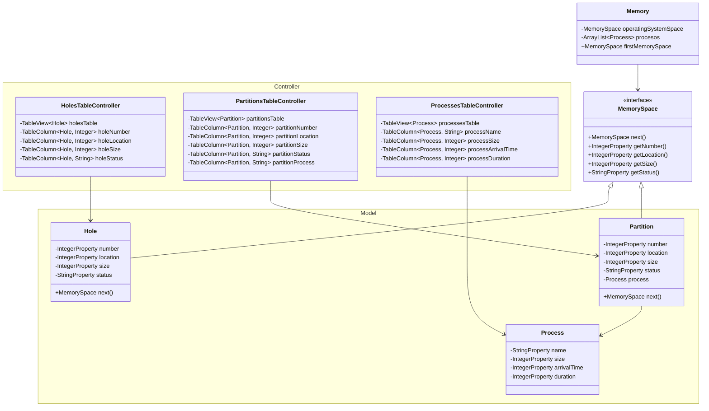

```mermaid

classDiagram

namespace Model{
    class Hole
    class Process
    class Partition
}

namespace Controller{
    class HolesTableController
    class PartitionsTableController
    class ProcessesTableController
}

class MemorySpace{
    <<interface>>
    +MemorySpace next()
    +IntegerProperty getNumber()
    +IntegerProperty getLocation()
    +IntegerProperty getSize()
    +StringProperty getStatus()
}

class Hole{
    -IntegerProperty number
    -IntegerProperty location
    -IntegerProperty size
    -StringProperty status
    
    +MemorySpace next()
}

class Partition{
    -IntegerProperty number
    -IntegerProperty location
    -IntegerProperty size
    -StringProperty status
    -Process process

    +MemorySpace next()
}

class Process{
    -StringProperty name
    -IntegerProperty size
    -IntegerProperty arrivalTime
    -IntegerProperty duration
}


class HolesTableController{
    -TableView~Hole~ holesTable
    -TableColumn~Hole, Integer~ holeNumber
    -TableColumn~Hole, Integer~ holeLocation
    -TableColumn~Hole, Integer~ holeSize
    -TableColumn~Hole, String~ holeStatus
}

class PartitionsTableController{

    -TableView~Partition~ partitionsTable
    -TableColumn~Partition, Integer~ partitionNumber
    -TableColumn~Partition, Integer~ partitionLocation
    -TableColumn~Partition, Integer~ partitionSize
    -TableColumn~Partition, String~ partitionStatus
    -TableColumn~Partition, String~ partitionProcess

}

class ProcessesTableController{
    -TableView~Process~ processesTable
    -TableColumn~Process, String~ processName
    -TableColumn~Process, Integer~ processSize
    -TableColumn~Process, Integer~ processArrivalTime
    -TableColumn~Process, Integer~ processDuration
}

Partition --> Process

ProcessesTableController --> Process
PartitionsTableController --> Partition
HolesTableController --> Hole

class Memory{
    -MemorySpace operatingSystemSpace

    -ArrayList~Process~ procesos
    ~MemorySpace firstMemorySpace
}


Memory --> MemorySpace

MemorySpace <|-- Partition
MemorySpace <|-- Hole


```